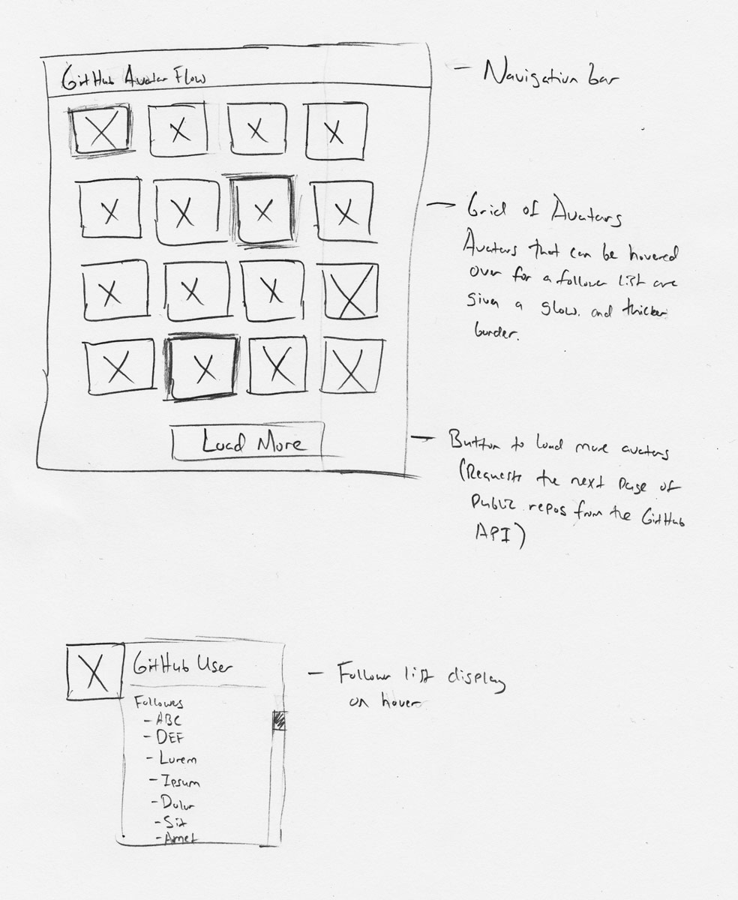

#GitHub Avatar Flow Code Challenge
##Design Document - v1.1

---

## Overview
GitHub Avatar Flow displays the avatars for owners of public repositories on GitHub. When the user hovers over certain avatars, it also displays a list of users following them. 

To implement these features, the software uses a browser-based client app using React, as well as a backend server and API using Node.js and Express.

## Application Design
### Major systems

#### Client application
The client application utilizes React to render a representation of the data returned from the server to the user. It does not make requests directly to the GitHub API; instead, it makes requests to the Node API, which in turn makes requests to GitHub and processes the information it receives before returning it to the client app.

#### Backend API
The backend uses Node and Express to create an API that will retrieve information from the GitHub API. After receiving the information for GitHub, the API will process it so that only the information that the client app needs is returned to it.

### Subsystems
#### Client application
The client application consists of several components:

##### Navbar
- Stateless component that shows the name of the project and visually 'grounds' the page (even though there is no navigation on the site).

##### AvatarList
- Stores the data returned from the backend in state in an array of users. This data consists of
    - an avatar URL (string), 
    - a username, referred to as a 'login' (string),
    - a user ID (integer)
- Contains render logic to handle displaying a list of Avatar components.
    - Each Avatar's React key will be the **id** of its associated user.
- Duplicate users are filtered out, and not displayed.

##### Avatar
- Displays the profile image for a user on GitHub.
- If the associated user's login starts with 'A', case-insensitive, displays a list of users following this user in a Bootstrap popover.
- Stores the list of followers for this user (array of strings). This information is only requested from GitHub if the user's login starts with 'A', case-insensitive, and only when the user hovers over their avatar.

#### Backend API
The backend API will consist of two GET routes, both of which will query the GitHub API using Axios and return only the data that the frontend will need.

##### GET /repos/:since
- Parameters: 
    - Since (integer)
- Queries the GitHub API for a list of public repos, beginning with the number specified in the query 'since' parameter.
- The GitHub API will only return a [page](https://developer.github.com/v3/guides/traversing-with-pagination/) of the full repo list. When the user needs more repos, we'll send another request starting from the last one they have seen.
- Processes the data into an array of objects, each containing **the repo owner's login, the repo owner's id, and the URL link to their avatar**.

##### GET /followers/:login
- Parameters: 
    - Login (string)
- Queries the GitHub API for the logins of all of the users who follow the specified user.
- Processes the data into an array of objects, each containing **the followers owner's login and their id**.

## UI Mockup

## Coding Style
The code base will use follow the Airbnb coding style with a few modifications, enforced by the ESLint plugin. 

These modifications can be found in the .eslintrc file - each of the applications has one. All but one were made out of personal preference. ("newline-after-import" is disabled because it appeared to be giving false-positives during production.)

## Testing
The React frontend will be tested through React's built-in testing framework, which utilizes Jest and Enzyme. API calls will be mocked using jest-fetch-mock.

The Node backend will be tested using Jasmine.

### Frontend
- React components will need to be tested for correct output and, in the case of the Avatar component, proper reaction to the onHover event.

### Backend
- Both of the routes will be tested to ensure they return proper status codes, return the data that the client app needs, and only the data the client app needs.
